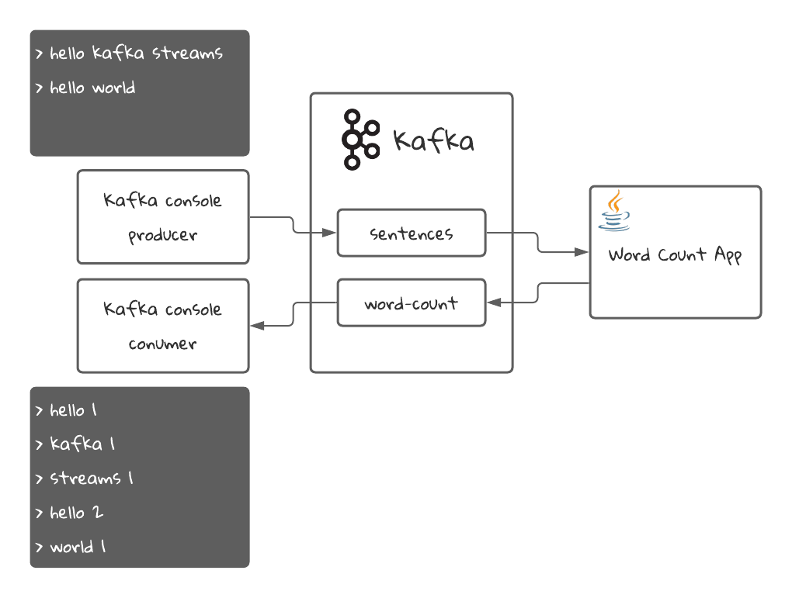

# Kafka Streams Word Count Application
The Kafka Streams word count application is the classic "Hello World!" example for Kafka Streams.
It helps to introduce some main concepts of the library.
##Application Diagram
Here is a simple diagram for this application:


The Java application will read sentences from the `sentences` topic in Kafka and will count the amount of times each word has appeared in all the sentences. Then it will stream the latest count for each word into the `word-count` topic, which we will read with a Kafka console consumer.
## Requirements
* Docker: We will use it to start Kafka and create the topics
* Java 15
* An IDE like Intellij IDEA

## Running the project

### Starting Kafka
First, we need to start Kafka. For that we have a [docker-compose.yml file](docker-compose.yml) that will create the necessary resources for us. It will start a Zookeeper instance and a Kafka broker. It will also create the necessary topics using the script found in the [create-topics.sh](./scripts/create-topics.sh) file.
```shell
docker compose -f ./docker-compose.yml up
```
### Building and starting the application
```shell
./mvnw clean package
```
### Publishing a message and consuming the results
1. we need to connect to the docker container to run commands on a CLI:
```shell
docker exec -it kafka /bin/bash
```
2. we create a console consumer to consume the `word-count` topic:
```shell
kafka-console-consumer --topic word-count --bootstrap-server localhost:9092 \
 --from-beginning \
 --property print.key=true \
 --property key.separator=" : " \
 --key-deserializer "org.apache.kafka.common.serialization.StringDeserializer" \
 --value-deserializer "org.apache.kafka.common.serialization.IntegerDeserializer"
```
3. Open a new terminal and connect again to the kafka docker container:
```shell
docker exec -it kafka /bin/bash
```
4. Create a console producer to insert sentences in the `sentences` topic:
```shell
kafka-console-producer --topic sentences --bootstrap-server localhost:9092
```
5. In your console producer, insert the following messages:
```
>Hello kafka streams
>Hello world
```
6. In your console consumer terminal, you should see the following result:
```
hello : 1
kafka : 1
streams : 1
hello : 2
world : 1
```
What you see is the words that we inserted in step 5, followed by the amount of times that word was processed. That's why the word `hello` appears twice.
